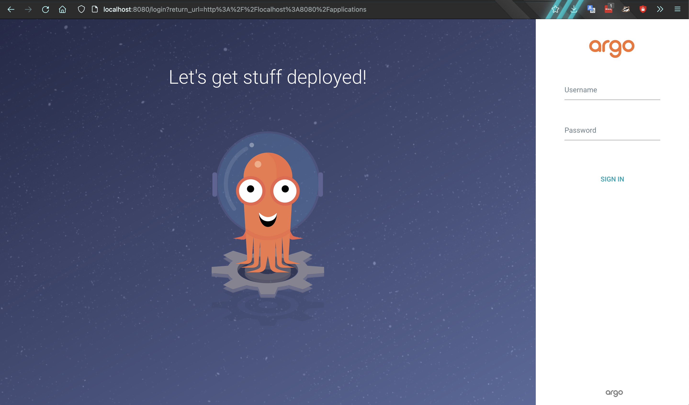

# Kubernetes, ArgoCD, and Vault
Just a quick example of how to set up a test Kuberentes (k8s) environment with KIND, and then using ArgoCD. Uses Hashicorp's Vault for secret storage :)

# Tech stack and Dependencies
## Package Managers
- [brew](https://brew.sh/) - Missing package manager for Mac (also supports Linux)
  - Also got some scripts for Debian distros
- [helm2](https://helm.sh/docs/intro/quickstart/) installs k8s apps (mostly a bunch of k8s yamls)

## Container Orchestration
- [Docker](https://www.docker.com/get-started/) - for the containers
- [Kubernetes](https://kubernetes.io/docs/concepts/overview/what-is-kubernetes/) - [THE CLUSTER](media/peridot.png) we use to scale containers :3
  - [KIND](https://kind.sigs.k8s.io/) - Tool to spin up mini k8s cluster locally

## Secrets Management
[Vault](https://github.com/hashicorp/vault) - Open source secret management from Hashicorp

## Continuous Delivery
[ArgoCD](https://argo-cd.readthedocs.io/en/stable/) - Continuous Delivery for k8s, from within k8s
- [Argo CLI tool](https://argo-cd.readthedocs.io/en/stable/cli_installation/) - this will let you use ArgoCD without the web interface
- [ArgoCD Vault Plugin](https://argocd-vault-plugin.readthedocs.io/en/stable/installation/) - ArgoCD with Vault
- [ArgoCD Vault Replacer](https://github.com/crumbhole/argocd-vault-replacer)
### Config Management (K8s)
[Kustomize](https://kustomize.io/) - kubernetes native config managment to install argo with vault

# Installation of quick k8s cluster (KIND)
## brew (On MacOS/Linux)
Make sure you have the `Brewfile` from this repo and then run: 
```bash
brew bundle install deps/Brewfile
```

## apt (On Debian distros)
This goes through the whole process with apt
```bash
.deps/apt_dep_installation.sh
```

Then you can create a quick small cluster with the below command. It will create a cluster called kind, and it will have one node, but it will be fast, like no more than a few minutes. 

```bash
$ kind create cluster
Creating cluster "kind" ...
 ✓ Ensuring node image (kindest/node:v1.21.1) 🖼
 ✓ Preparing nodes 📦
 ✓ Writing configuration 📜
 ✓ Starting control-plane 🕹️
 ✓ Installing CNI 🔌
 ✓ Installing StorageClass 💾
Set kubectl context to "kind-kind"
You can now use your cluster with:

kubectl cluster-info --context kind-kind

Not sure what to do next? 😅  Check out https://kind.sigs.k8s.io/docs/user/quick-start/
```

*Note: make sure you have kubectl installed, and you can install that with brew as well*

You'll want to follow kind advice and get some important info with, as well as verify the cluster is good to go:
``` bash
$ kubectl cluster-info --context kind-kind
Kubernetes control plane is running at https://127.0.0.1:64067
CoreDNS is running at https://127.0.0.1:64067/api/v1/namespaces/kube-system/services/kube-dns:dns/proxy

$ kind get clusters
kind

$ kg namespaces
NAME                 STATUS   AGE
default              Active   27m
kube-node-lease      Active   27m
kube-public          Active   27m
kube-system          Active   27m
local-path-storage   Active   27m
```

Now that we've verified we have a local k8s cluster, let's get Argo and Vault up and running!

# ArgoCD
Before doing anything, you'll need some namespaces:
```
kubectl create namespace argocd
kubectl create namespace vault
```

## Argo CD with Vault (Kustomize Install)
```bash
# Create a Directory to Store the yamls
mkdir kustomize && cd kustomize

# Download all the graciously provided - can also use curl
wget https://raw.githubusercontent.com/argoproj-labs/argocd-vault-plugin/main/manifests/argocd-cm.yaml
wget https://raw.githubusercontent.com/argoproj-labs/argocd-vault-plugin/main/manifests/argocd-repo-server-deploy.yaml
wget https://raw.githubusercontent.com/argoproj-labs/argocd-vault-plugin/main/manifests/kustomization.yaml

# go up one dir
cd ..

# apply the kustomize files
k apply -k kustomize
```

## Helm Installation without Vault
First we'll need helm (`brew install helm`, if you haven't already). Then, if you want this to be repeatable, you can clone this repo because you'll need to create the `Chart.yaml` and `values.yaml` in `charts/argo`. You can update your `version` parameter in `charts/argo/Chart.yaml` to the `version` param you see in [this repo](https://github.com/argoproj/argo-helm/blob/master/charts/argo-cd/Chart.yaml), at whatever time in the future that you're working on this. If you don't verify that version you will end up like me, half way down this article... :facepalm:

Then you can run the following helm commands:

```bash
$ helm repo add argo https://argoproj.github.io/argo-helm
"argo" has been added to your repositories

$ helm dep update charts/argo/
Hang tight while we grab the latest from your chart repositories...
...Successfully got an update from the "argo" chart repository
Update Complete. ⎈Happy Helming!⎈
Saving 1 charts
Downloading argo-cd from repo https://argoproj.github.io/argo-helm
Deleting outdated charts
```

The next thing you need to do do is install the chart with:

```bash
$ helm install argo-cd charts/argo/
```

### How to fix crd-install issue (Skip if no issue on `helm install`)
*Why and How*
You would see this:
```bash
$ helm install argo-cd charts/argo/
manifest_sorter.go:192: info: skipping unknown hook: "crd-install"
manifest_sorter.go:192: info: skipping unknown hook: "crd-install"
NAME: argo-cd
LAST DEPLOYED: Wed May 11 10:53:55 2022
NAMESPACE: default
STATUS: deployed
REVISION: 1
TEST SUITE: None
```

You need those CRDs, or the pod will just crash loop, and then when you try to follow the next logical step of port-forwarding to test the frontend, you'll get something like this, when you actually test it:
```bash
$ kubectl port-forward svc/argo-cd-argocd-server 8080:443
Forwarding from 127.0.0.1:8080 -> 8080
Forwarding from [::1]:8080 -> 8080
Handling connection for 8080
```

Which seems fine, but when you go to http://localhost:8080 in your browser you'll see this in stdout in your terminal:
```
E0511 11:07:43.094956   46063 portforward.go:406] an error occurred forwarding 8080 -> 8080: error forwarding port 8080 to pod 53c2b12a3c748bb2c9acd763ed898c5261227ca4b359c047ec264608cbc67058, uid : failed to execute portforward in network namespace "/var/run/netns/cni-84865981-c6a2-6e6d-1ce1-336602591e41": failed to connect to localhost:8080 inside namespace "53c2b12a3c748bb2c9acd763ed898c5261227ca4b359c047ec264608cbc67058", IPv4: dial tcp4 127.0.0.1:8080: connect: connection refused IPv6 dial tcp6 [::1]:8080: connect: connection refused
E0511 11:07:43.095553   46063 portforward.go:234] lost connection to pod
Handling connection for 8080
E0511 11:07:43.096354   46063 portforward.go:346] error creating error stream for port 8080 -> 8080: EOF
```

This happens because you're using an older version of argoCD, and is apparently because of [this issue](https://github.com/bitnami/charts/issues/7972) and is fixed by [this](https://github.com/helm/helm/issues/6930), so you can just update your version.

*Fix*
Update `version` of your `charts/argo/Chart.yaml` to at least 4.6.0 (cause that's what worked for me :D)

Then you'll need to rerun the dep update:
```bash
helm dep update charts/argo/
```

Followed by uninstalling, and then reinstalling:
```bash
$ helm uninstall argo-cd
release "argo-cd" uninstalled
```

### Resume here after CRD issue detour
Now, for the perfect installation of our dreams:
```bash
$ helm install argo-cd charts/argo/
NAME: argo-cd
LAST DEPLOYED: Wed May 11 14:52:59 2022
NAMESPACE: default
STATUS: deployed
REVISION: 1
TEST SUITE: None
```
:chef-kiss:

## Argo via the GUI
You'll need to test out the front end, but before you can do that, you need to do some port forwarding:
```bash
# Do this one if you didn't install ArgoCD with Vault
$ kubectl port-forward svc/argo-cd-argocd-server 8080:443
Forwarding from 127.0.0.1:8080 -> 8080
Forwarding from [::1]:8080 -> 8080
Handling connection for 8080
```
or
```bash
# Do this if you installed ArgoCD WITH Vault
$ kubectl port-forward svc/argocd-server 8080:443
Forwarding from 127.0.0.1:8080 -> 8080
Forwarding from [::1]:8080 -> 8080
Handling connection for 8080
```

SUCCESS, we now get this in the browser:



You can now login with the default username, `admin`, and auto-generated password from this k8s secret:
```bash
kubectl get secret argocd-initial-admin-secret -o jsonpath="{.data.password}" | base64 -d
```

### CLI
First you should generate cli completion for your shell of choice. In my case, it was BASH:
```bash
$ argocd completion bash > ~/.bashrc_argocd
$ source ~/.bashrc_argocd

# need to port forward, but we want this in the background
$ kubectl port-forward svc/argo-cd-argocd-server 8080:443 &
```

You'll need to make sure you have your argo CD server address set with:
```bash
# create the default config location:
$ mkdir -p ~/.config/argocd/config

# missing argo config set up ???

# then you can run the following
$ argocd login localhost:8080 --username admin --password $yourpassword
```
#### WARNING: the above command will fail right now

If you don't have the argoCD server address already specified you'll get this:
```bash
FATA[0000] Argo CD server address unspecified
```

# Vault
Follow along [here](https://learn.hashicorp.com/tutorials/vault/kubernetes-raft-deployment-guide?in=vault/kubernetes).

```bash
# add the helm repo
helm repo add hashicorp https://helm.releases.hashicorp.com

# create a spot for the chart
mkdir charts/vault && cd charts/vault/

# can also curl chart here
wget https://raw.githubusercontent.com/hashicorp/vault-helm/main/Chart.yaml
```

# Success!
You can check out another tutorial for kafka on k8s [here](https://github.com/jessebot/argo-kafka-example)
